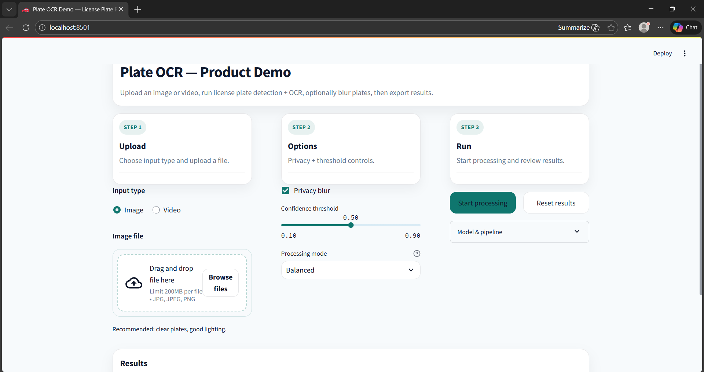
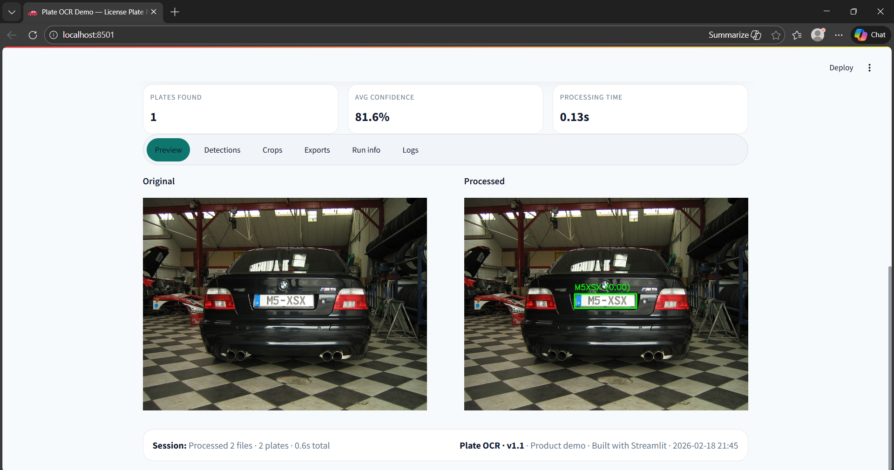

# Plate OCR — License Plate Recognition & Privacy Filter


A production-ready **License Plate Recognition (LPR)** system that detects license plates, recognizes text, optionally applies privacy blurring, and supports **both images and videos** through a clean Streamlit UI.

This project is designed as a **portfolio-grade AI engineering demo**, not a toy script.

---

## ✨ What it does

- Detects license plates using **YOLOv8 (Ultralytics)**
- Recognizes plate text using a **CRNN OCR model (PyTorch)**
- Optional **privacy blur** for detected plates
- Supports **image and video** inputs
- Exports results as **annotated media + JSON / CSV**
- Clean, company-ready Streamlit interface

---

## 🧠 Technical Highlights

- **Modular inference pipeline** (detect → crop → OCR → overlay → export)
- **CTC-style decoding** for OCR output
- **Frame skipping** for efficient video processing
- **Robust path resolution** (works locally and in common repo layouts)
- **Unit tests + linting** (pytest + ruff)
- **No model weights committed** (real-world best practice)

---

## 🧱 Tech Stack

- **YOLOv8 (Ultralytics)** — license plate detection
- **PyTorch** — CRNN OCR model
- **OpenCV** — image and video processing
- **Torchvision** — preprocessing transforms
- **Streamlit** — UI
- **Docker** — containerized deployment
- **pytest + ruff** — testing and linting

---

## 📁 Project Structure

```
plate-ocr/
├─ app/
│  └─ streamlit_app.py
├─ src/
│  ├─ inference.py
│  ├─ model.py
│  ├─ dataset.py
│  ├─ process_video.py
│  └─ paths.py
├─ assets/
│  └─ models/          # YOLO detector weights (local only, not in git)
├─ model/              # OCR weights + vocab (local only, not in git)
├─ examples/
│  ├─ test_image.jpg
│  └─ test_video.mp4
├─ tests/
├─ outputs/            # generated outputs (local only)
├─ Dockerfile
├─ docker-compose.yml
├─ requirements.txt
└─ README.md
```

---

## System Architecture

```text
Image / Video Input
        ↓
YOLOv8 Plate Detector
        ↓
Plate Crop Extraction
        ↓
CRNN OCR Model
        ↓
CTC-style Decoding
        ↓
Annotated Output + JSON/CSV Export

## 📦 Model Weights (Required)

Model weights are **not included in the repository**.

Place these files locally:

### 1) Detector (YOLO)
- `assets/models/last.pt`

### 2) OCR (CRNN)
- `model/plate_model_v1.pth`
- `model/char_to_idx.json`

> If your filenames differ, update the references inside:
> - `app/streamlit_app.py` (YOLO weight filename)
> - `src/inference.py` (OCR weights + vocab)

---

## ▶️ Run Locally (CPU)

### 1) Create and activate a virtual environment

```bash
python -m venv venv

# Windows
venv\Scripts\activate

# macOS / Linux
source venv/bin/activate
```

### 2) Install dependencies

```bash
pip install -r requirements.txt
```

### 3) Add required model files

Make sure these exist locally:

- `assets/models/last.pt`
- `model/plate_model_v1.pth`
- `model/char_to_idx.json`

### 4) Install FFmpeg (required for video processing)

**Windows**
```bash
winget install Gyan.FFmpeg
```

Verify:
```bash
ffmpeg -version
```

> FFmpeg is required for video preview and processing.  
> Image-only usage does not require FFmpeg.

### 5) Run the app

```bash
streamlit run app/streamlit_app.py
```

Open in browser: http://localhost:8501

---

## 🐳 Run with Docker (recommended)

### Requirements
You must have these files on your machine (not in git):
- `assets/models/last.pt`
- `model/plate_model_v1.pth`
- `model/char_to_idx.json`

### Run
```bash
docker compose up --build
```

Open in browser: http://localhost:8501

---

## 🧪 Tests & Linting

```bash
pytest
ruff check .
```

---

## 🚀 Use Cases

- Smart city and traffic monitoring
- Parking and toll systems
- Privacy-aware video analytics
- AI/ML engineering portfolio demonstration

---

## 📜 License

MIT License. See `LICENSE`.

---

## 🖼️ Screenshots

### UI


### Sample result

